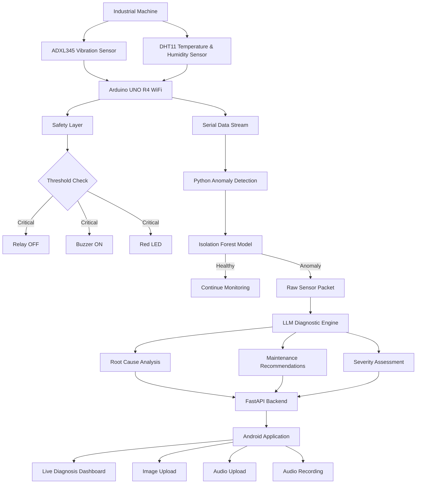
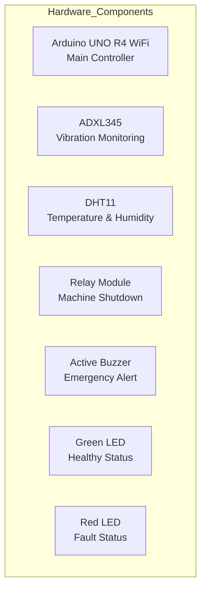
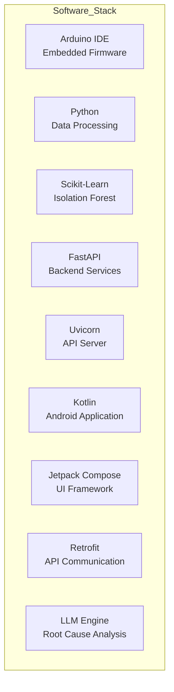

# ForgeMind
## AI-Powered Industrial Predictive Maintenance System

ForgeMind is an intelligent industrial monitoring and predictive maintenance platform that combines IoT sensing, real-time anomaly detection, machine safety automation, LLM-powered diagnostics, and a mobile application to reduce downtime and detect machine failures before they become critical.

# Problem Statement

## Industrial machinery often fails due to:

Excessive vibration
Overheating
Bearing wear
Shaft misalignment
Mechanical imbalance
Poor maintenance schedules

Traditional threshold-based systems only react after a fault becomes severe.

ForgeMind introduces an AI-driven pipeline that continuously monitors machine health, detects anomalies in real time, automatically triggers safety actions, and generates intelligent maintenance insights.

# Features
- Real-Time Sensor Monitoring
  - Temperature Monitoring (DHT11)
  - Humidity Monitoring (DHT11)
  - Vibration Monitoring (ADXL345)
- Machine Protection
  - Automatic Relay Shutdown
  - Emergency Buzzer Alerts
  - Visual Status Indicators (LEDs)
- AI Anomaly Detection
  - Isolation Forest model trained on healthy operating data
  - Detects deviations from normal machine behavior
  - Generates anomaly scores in real time
- Intelligent Diagnostics
  - Raw anomalous sensor packets forwarded to LLM layer
  - Root-cause analysis generation
- Maintenance recommendations
  -Failure explanation
-Mobile Application
  -Image Upload
  -Audio Upload
  -Audio Recording
  -Sensor Data Submission
  -Diagnosis Dashboard

# System Architecture

# System Workflow

- ForgeMind continuously monitors industrial equipment using vibration and environmental sensors connected to an Arduino UNO R4. Sensor data is streamed to an anomaly detection engine powered by an Isolation Forest model trained on healthy operational behavior.

- When abnormal patterns are detected, the raw sensor packet is forwarded to an LLM-powered diagnostic layer running on Qualcomm AI hardware. The model performs root-cause analysis, generates maintenance recommendations, and assigns severity levels.

- Results are exposed through a FastAPI backend and visualized in a Kotlin-based Android application, enabling operators to receive actionable maintenance intelligence in real time.

# Hardware Components

# Software Stack

